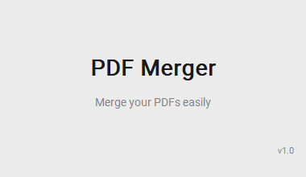
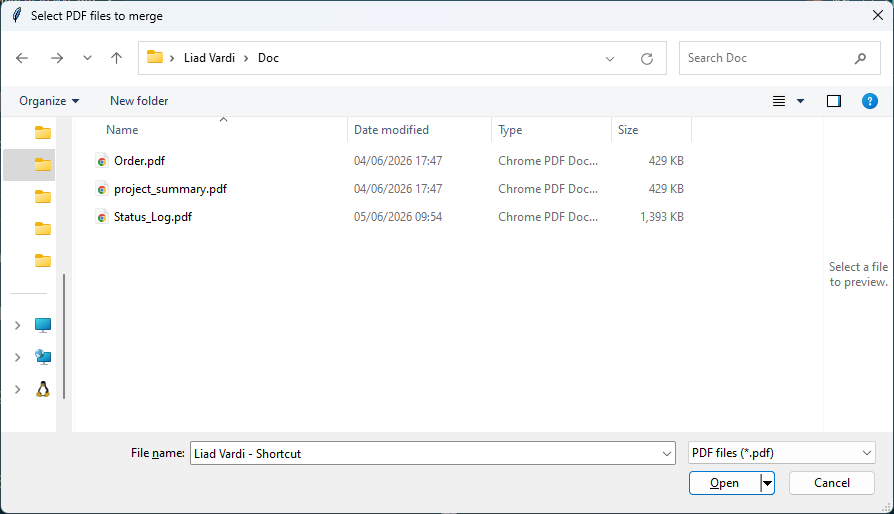
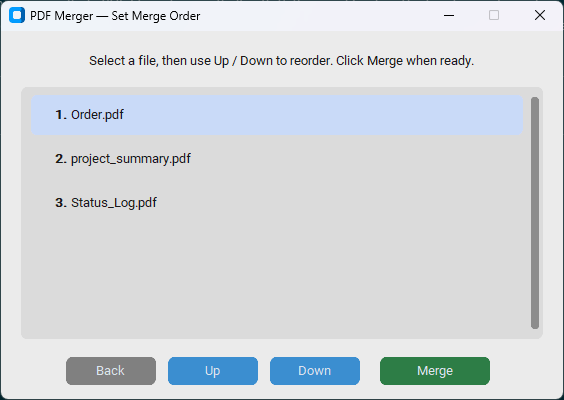
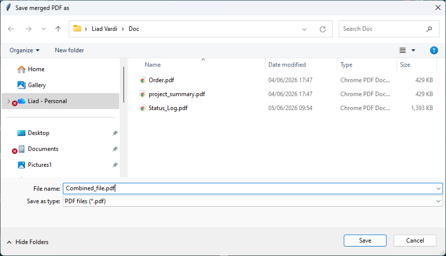
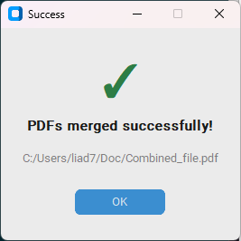
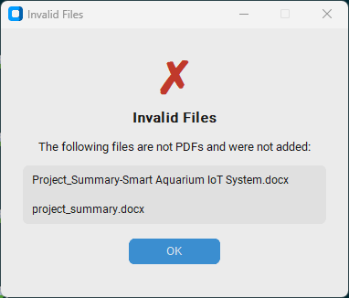

# 🗂️ PDF Merger


A modern desktop application for merging multiple PDF files into one. Built with Python and CustomTkinter, it provides a clean, cross-theme GUI that guides the user from file selection through reordering to the final merged output — all without writing a single line of code or touching the terminal.

---

## Application Showcase

### 1. Splash Screen
<p align="center"></p>

### 2. File Picker
<p align="center"></p>

### 3. Reorder Window
<p align="center"></p>

### 4. Save Dialog
<p align="center"></p>

### 5. Success Dialog
<p align="center"></p>

### 6. Invalid Files Dialog
<p align="center"></p>

---

## Key Features

- **Splash screen** — branded loading screen shown during startup so the app never feels frozen
- **Multi-file selection** — pick any number of PDF files from anywhere on the filesystem
- **PDF validation** — detects and reports non-PDF files before any processing begins, with a clear error dialog listing each invalid file by name
- **Drag-to-reorder** — intuitive Up / Down controls let the user set the exact merge order before committing
- **Back navigation** — return to the file picker from the reorder window without restarting the app
- **Custom save location** — choose the output filename and folder via a native save dialog; defaults to the source folder
- **Styled dialogs** — success and error feedback rendered as CustomTkinter dialogs consistent with the rest of the UI
- **Auto-dependency install** — missing packages (`pypdf`, `customtkinter`) are installed automatically on first run
- **Dark / light mode** — follows the operating system appearance setting out of the box
- **Single-file EXE** — ships as a standalone executable built with PyInstaller; no Python installation required for end users

---

## Technology Stack

| Component | Technologies |
|---|---|
| GUI framework | [CustomTkinter](https://github.com/TomSchimansky/CustomTkinter) |
| PDF engine | [pypdf](https://github.com/py-pdf/pypdf) |
| Native dialogs | `tkinter.filedialog` |
| Packaging | [PyInstaller](https://pyinstaller.org) |
| Language | Python 3.10+ |

---

## Project Structure

```
pdf-merger/
├── main.py          # Entry point — shows splash screen, then launches the app
├── gui.py           # All windows and dialogs (SplashScreen, ReorderWindow,
│                    #   InvalidFilesDialog, SuccessDialog) and the main() flow
├── merger.py        # PDF logic — validate_pdfs() and merge_pdfs()
├── utils.py         # install_package() helper + auto-install blocks for dependencies
└── requirements.txt # pypdf, customtkinter
```

---

## Quick Start

### Prerequisites

```bash
pip install -r requirements.txt
```

### Run from source

```bash
python main.py
```

### Build a standalone EXE

```bash
python -m PyInstaller --onefile --windowed --name "PDF Merger" main.py
```

The executable will be created at `dist/PDF Merger.exe`. Double-click it to run — no Python installation needed.

---

## AI Assistance

This project was developed with [Claude](https://claude.ai) (Anthropic) as a pair-programming tool. Claude assisted with code generation, iterative feature additions, refactoring from a single-file script into a modular project structure, and design decisions throughout the development process. All code was reviewed and validated by the developer.
